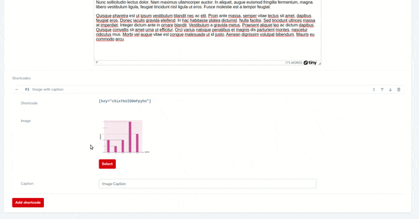

# Laravel nova shortcode based on "nova-flexible-content"

[](https://github.com/yaroslawww/nova-flexible-content-field-shortcode/blob/master/LICENSE.md)
[](https://packagist.org/packages/yaroslawww/nova-flexible-content-field-shortcode)
[](https://packagist.org/packages/yaroslawww/nova-flexible-content-field-shortcode)
[](https://scrutinizer-ci.com/g/yaroslawww/nova-flexible-content-field-shortcode/build-status/master)
[](https://scrutinizer-ci.com/g/yaroslawww/nova-flexible-content-field-shortcode/?branch=master)
[](https://scrutinizer-ci.com/g/yaroslawww/nova-flexible-content-field-shortcode/?branch=master)

A very highly targeted package. Designed specifically for the ability to add shortcodes to existing content. If you are
just starting to develop an application then just use "yaroslawww/nova-flexible-content" or alternative without using
this package. The package is needed if you already have a large amount of content, and the client requires adding new
functionality

| Nova | Package |
|------|---------|
| V1   | V1 V2   |
| V4   | V3      |

## Installation

You can install the package via composer:

1. Install "flexible content" package.

```bash
composer require yaroslawww/nova-flexible-content
```

2. Install "shortcode" package

```bash
composer require yaroslawww/nova-flexible-content-field-shortcode
# optional publish configs
php artisan vendor:publish --provider="ThinkOne\NovaFlexibleContentFieldShortcode\ServiceProvider" --tag="config"
```

## Usage

1. `ShortcodeText` field. You need add it to **top level** layouts in you flexible content

```
ShortcodeText::make('Shortcode')->help('All parameters you can find <a href="//some-link">here</a>'),
```

Example:

```injectablephp
Flexible::make('Shortcodes', 'shortcodes')
    ->addLayout('Image with caption', 'image', [
        ShortcodeText::make('Shortcode'),
        Image::make('Image', 'image'),
        Text::make('Caption', 'caption'),
    ])
    ->addLayout('Images slider', 'slider', [
        ShortcodeText::make('Shortcode'),
        Flexible::make('Slider', 'slider')
                ->addLayout('Image with caption', 'slide', [
                    // Second level - "ShortcodeText" will not works
                    Image::make('Image', 'image'),
                    Text::make('Caption', 'caption'),
                ])
                ->button('Add slide'),
    ])
    ->button('Add shortcode')
    ->hideWhenCreating(),
```

2. Then user can copy shortcode to any other field - for example, into the rich editor.\
3. You need create "presenters" to display your shortcodes. Any presenter should implement
   interface `ThinkOne\NovaFlexibleContentFieldShortcode\ShortcodePresenter` \
   Example:

```injectablephp
use ThinkOne\NovaFlexibleContentFieldShortcode\ViewPresenter;

class ImageWithCaption extends ViewPresenter
{
    protected string $viewPath = 'my-folder.shortcodes.image-with-caption';
}
```

```
# my-folder/shortcodes/image-with-caption.blade.php
@if(!empty($shortcodeData) && !empty($shortcodeData['image']))
    <div class="...">
        <div class="...">
            
            @if(!empty($shortcodeData['caption']))
                <div class="...">
                    {{$shortcodeData['caption']}}
                </div>
            @endif
        </div>
    </div>
@endif
```

4. You can add "presenters" in config file (used as default) or directly when you call compiler:

```injectablephp
public function presentersMap(): array
{
    return [
        'image'  => ImageWithCaption::class,
        'EYsCY62xKnkHrvIo'  => AdHocImageWithCaption::class,
        'slider' => ImagesSlider::class,
    ];
}
```

5. Fill shortcode data and past shortcode to some fields in nova admin



6. Render content with processed shortcodes

```injectablephp
\ThinkOne\NovaFlexibleContentFieldShortcode\ShortcodeCompiler::make(
            $this->shortcodesData(), // array represent "nova-flexible-content" field
            $this->presentersMap() // array represent presenters map (key => class), see above
        )->renderShortcodes(
            $content // text containing shortcode, maybe you need to filter it to prevent xss
        )
```

### Example with trait

```injectablephp
class Article extends Model {

    use HasShortcodes;

    public function shortcodesMap(): array {
        return [ 'image' => ImageWithCaption::class, ];
    }

    public function getFullContentAttribute(): string {
        return $this->getDataWithShortcodes( WysiwygHelper::filter( (string) $this->content ) );
    }
    
    public function getFullContentOtherAttribute(): string {
        return $this->getDataWithShortcodes( WysiwygHelper::filter( (string) $this->content_other ) );
    }
}
```

Then call it:

```injectablephp
{!! $article->full_content !!}
{!! $article->full_content_other !!}
```

## Credits

- [](https://think.studio/)
